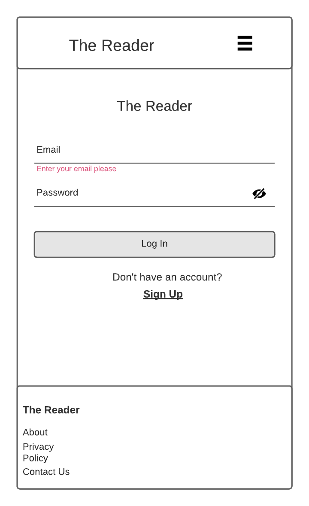
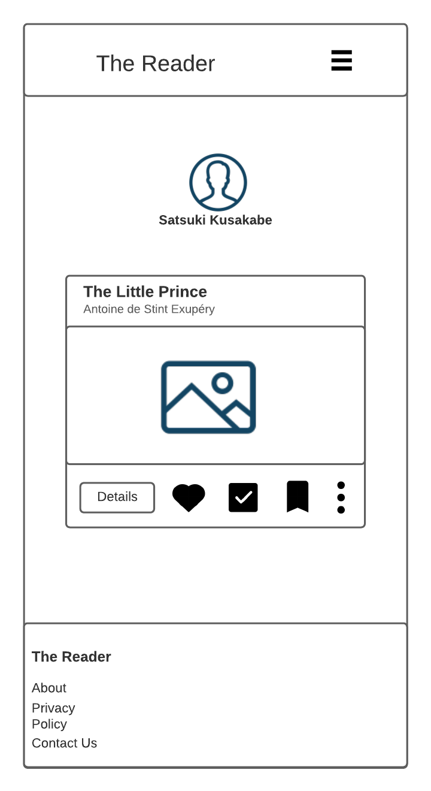
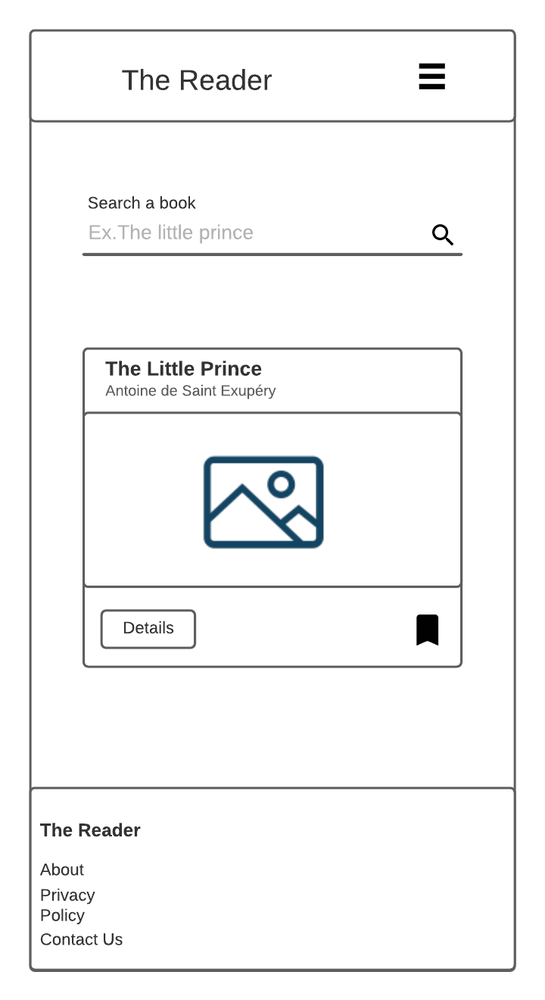
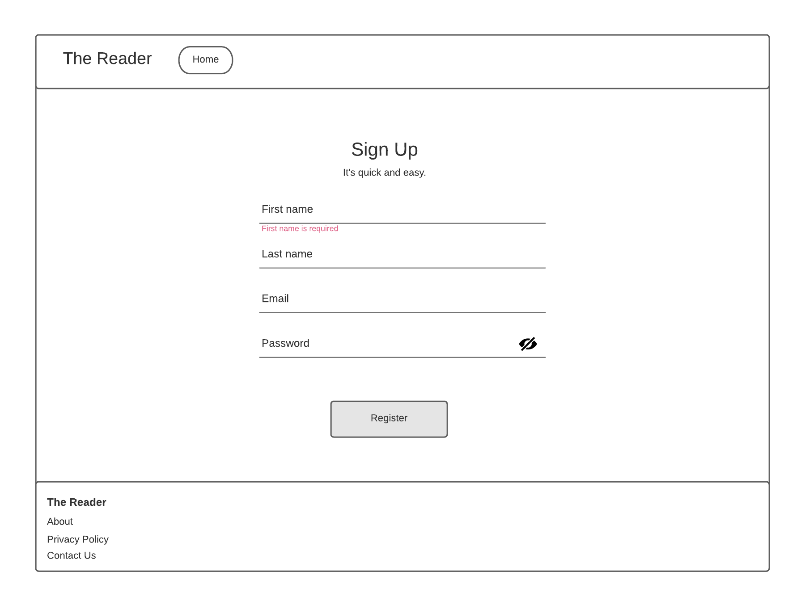
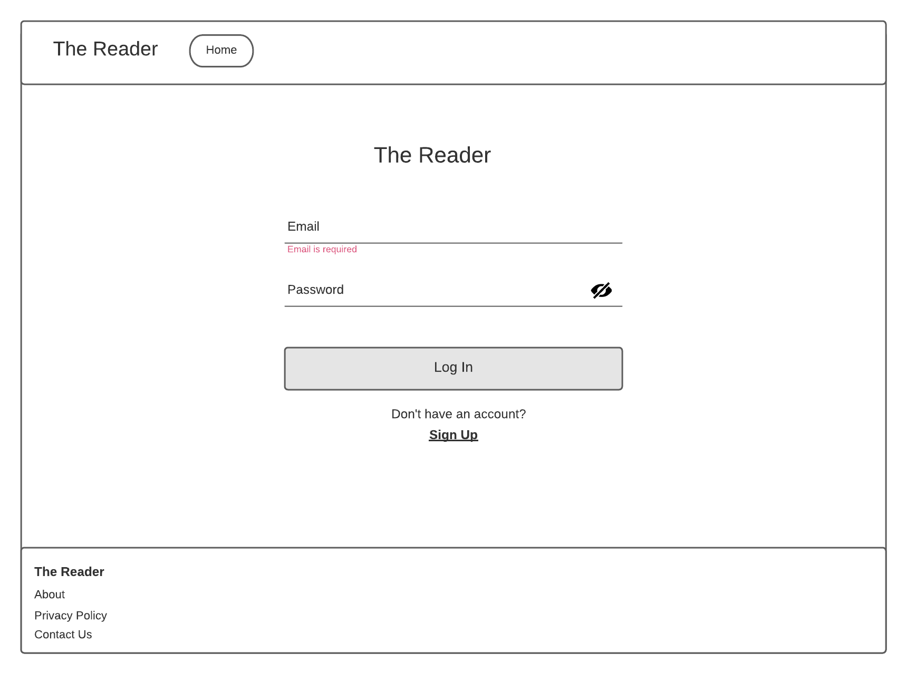
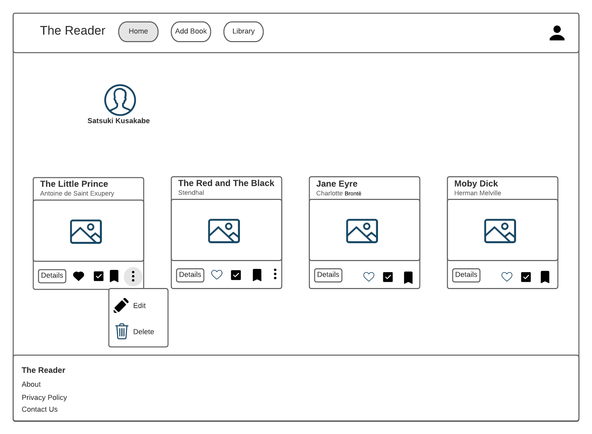

# The Reader
This is a CRUD app with authentication developed for my exam of my training at Renault Digital Inclusive University
 
# Functionalities
Issued for readers, here we can add a book to reading list
Mark as read when a reading is complete
Mark as favorite if it's the case

# Wireframes
## Signup mobile

## Login mobile

## Home mobile

## Add book form mobile

## Library mobile

*Desktop*

## Signup

## Login 

## Home 

## Add book form 

## Library 

