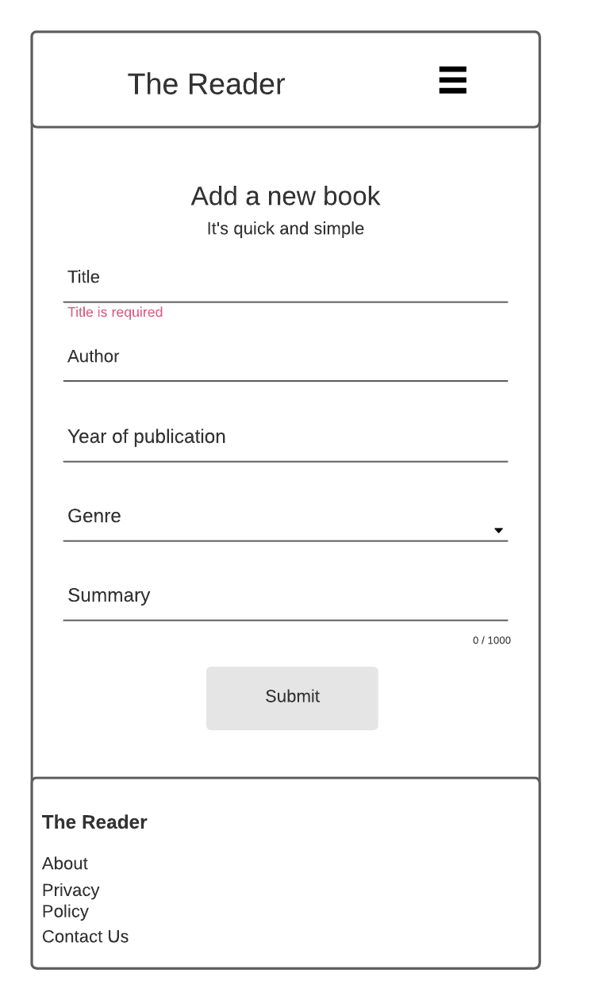
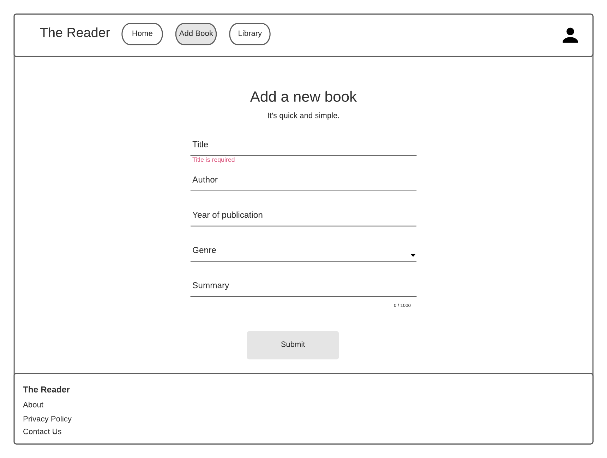
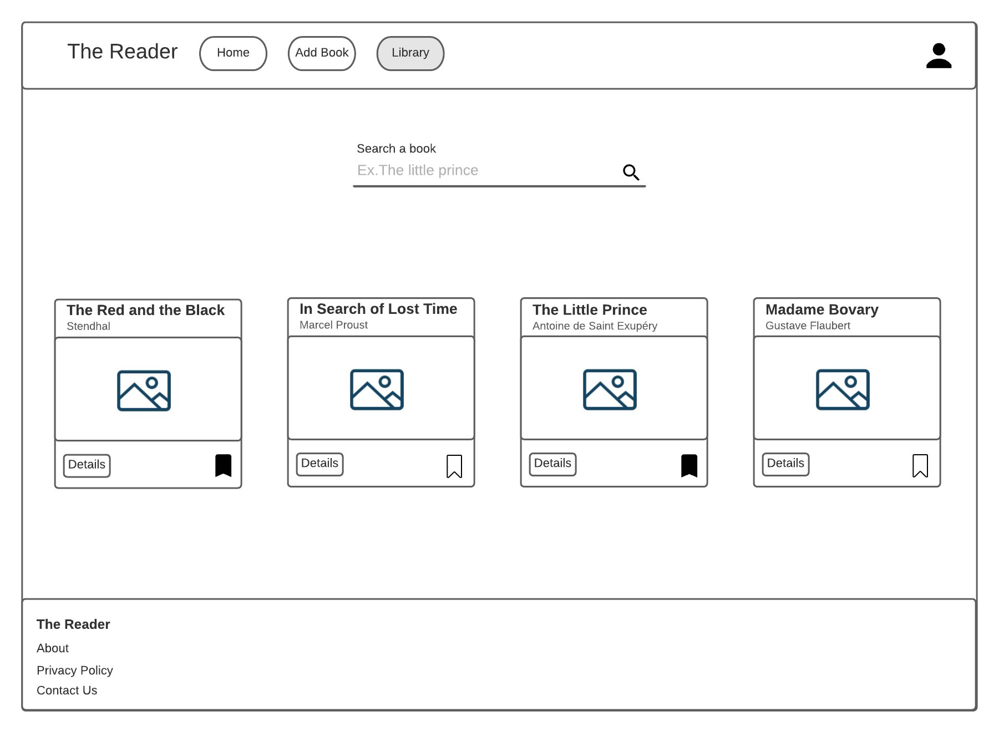

# The Reader
This is a CRUD app with authentication developed for the final exam of my training at Renault Digital Inclusive University and Simplon.co

# New
Pagination implemented on both home page and library page

# Features
Developed for addicted readers:
- Can add a book to reading list
- Mark as read when a reading is complete
- Mark as favorite

[Api Repository](https://github.com/akbar2023/TheReader_API)

# Wireframes
## Signup mobile

## Login mobile

## Home mobile

## Add book form mobile

## Library mobile

*Desktop*

## Signup

## Login 

## Home 

## Add book form 

## Library 

